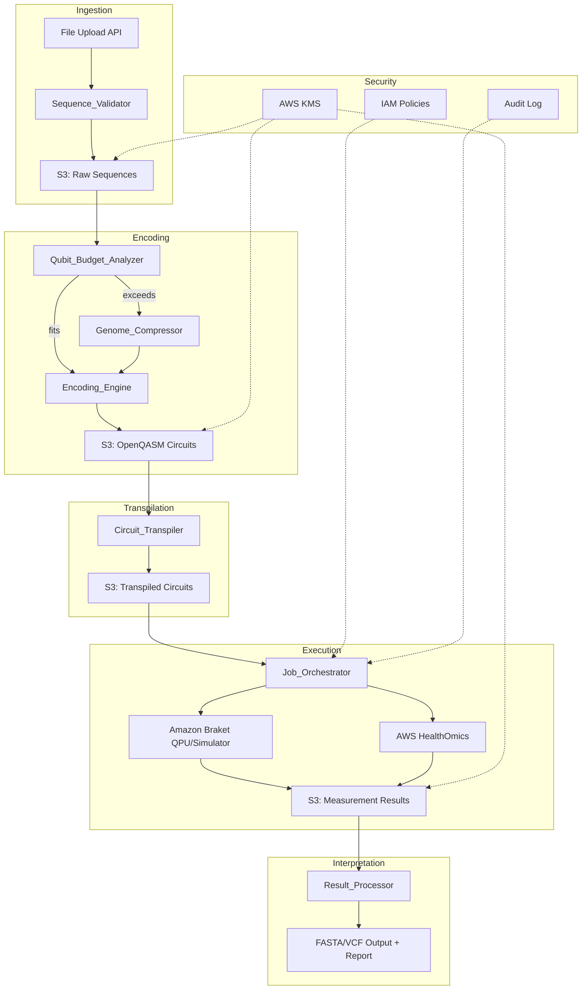

# Design Document: Quantum Genomics Encoding Pipeline

## Overview

The Quantum Genomics Encoding Pipeline is a cloud-native service that bridges classical genomics and quantum computing on AWS. It accepts standard genomic sequence files (FASTA, FASTQ, GenBank), encodes nucleotide sequences into quantum circuit representations, transpiles circuits for specific hardware backends, executes them via Amazon Braket, and decodes measurement results back into genomic information.

The system is composed of six core components orchestrated through a hybrid quantum-classical workflow engine:

1. **Sequence_Validator** — Ingests and validates genomic files
2. **Encoding_Engine** — Maps nucleotides to qubit states and produces OpenQASM 3.0 circuits
3. **Qubit_Budget_Analyzer / Genome_Compressor** — Determines hardware fit and partitions oversized genomes
4. **Circuit_Transpiler** — Adapts abstract circuits to hardware-native gate sets
5. **Job_Orchestrator** — Manages hybrid workflow execution via Braket Hybrid Jobs and HealthOmics
6. **Result_Processor** — Decodes measurement bitstrings into genomic sequences with confidence scores

### Key Design Decisions

| Decision | Choice | Rationale |
|----------|--------|-----------|
| Encoding density | 2 qubits per nucleotide (computational basis) | Minimal qubit overhead; direct mapping to 4 bases |
| Circuit format | OpenQASM 3.0 | Industry standard; supported by Braket SDK |
| Workflow orchestration | Braket Hybrid Jobs + Step Functions | Priority QPU queueing; DAG execution for mixed workloads |
| Data interchange | S3 intermediate storage | Both HealthOmics and Braket have native S3 integration |
| Compression strategy | Overlapping partitions (≥10nt overlap) | Enables lossless reconstruction without complex encoding |
| Hardware targets | IonQ Forte Enterprise (36q), Rigetti Cepheus-1 (108q) | Available via Braket; different gate sets cover trapped-ion and superconducting |

## Architecture



### Data Flow

1. Researcher uploads genomic file → Sequence_Validator parses and stores structured sequence in S3
2. Qubit_Budget_Analyzer evaluates sequence length against backend capacities
3. If sequence exceeds capacity, Genome_Compressor partitions with overlap
4. Encoding_Engine generates OpenQASM 3.0 circuit(s) and stores in S3
5. Circuit_Transpiler adapts to target hardware gate set
6. Job_Orchestrator submits via Braket Hybrid Jobs (with optional HealthOmics classical steps)
7. Result_Processor decodes measurement bitstrings and generates reports

## Components and Interfaces

### Sequence_Validator

**Responsibility:** Parse and validate genomic files in FASTA, FASTQ, and GenBank formats.

```typescript
interface SequenceValidator {
  validate(file: UploadedFile): Promise<ValidationResult>;
  parse(file: UploadedFile): Promise<ParsedSequence>;
}

interface ValidationResult {
  valid: boolean;
  errors: ValidationError[];
  warnings: string[];
  sequenceLength: number;
  format: 'FASTA' | 'FASTQ' | 'GenBank';
}

interface ValidationError {
  line: number;
  column: number;
  message: string;
  severity: 'error' | 'warning';
}

interface ParsedSequence {
  id: string;
  description: string;
  nucleotides: string;  // uppercase A, C, G, T/U characters
  length: number;
  type: 'DNA' | 'RNA';
  metadata: Record<string, string>;
}
```

### Encoding_Engine

**Responsibility:** Convert nucleotide sequences to quantum circuits using configurable encoding schemes.

```typescript
interface EncodingEngine {
  encode(sequence: ParsedSequence, scheme?: EncodingScheme): Promise<EncodedCircuit>;
  decode(measurements: MeasurementResult, scheme: EncodingScheme): Promise<DecodedSequence>;
  serialize(circuit: EncodedCircuit): string;  // OpenQASM 3.0
  deserialize(qasm: string): EncodedCircuit;
}

interface EncodingScheme {
  name: string;
  qubitsPerBase: number;
  mapping: Record<Nucleotide, string>;  // e.g., { A: '00', C: '01', G: '10', T: '11' }
}

interface EncodedCircuit {
  qasm: string;           // OpenQASM 3.0 representation
  qubitCount: number;
  gateCount: number;
  depth: number;
  scheme: EncodingScheme;
  sourceSequenceId: string;
  segmentIndex?: number;  // if from partitioned genome
}

type Nucleotide = 'A' | 'C' | 'G' | 'T' | 'U';
```

### Qubit_Budget_Analyzer & Genome_Compressor

**Responsibility:** Assess hardware fit and partition genomes that exceed backend capacity.

```typescript
interface QubitBudgetAnalyzer {
  analyze(sequence: ParsedSequence, scheme: EncodingScheme): BudgetAnalysis;
}

interface BudgetAnalysis {
  requiredQubits: number;
  backendFit: Record<BackendId, FitResult>;
  recommendation: 'direct' | 'compress' | 'partition';
}

interface FitResult {
  fits: boolean;
  availableQubits: number;
  utilizationPercent: number;
}

interface GenomeCompressor {
  partition(
    sequence: ParsedSequence,
    targetQubitCount: number,
    scheme: EncodingScheme,
    overlapNucleotides?: number  // default: 10
  ): PartitionedGenome;
  
  reassemble(partitions: PartitionedGenome): ParsedSequence;
}

interface PartitionedGenome {
  segments: GenomeSegment[];
  originalLength: number;
  overlapSize: number;
  totalSegments: number;
}

interface GenomeSegment {
  index: number;
  nucleotides: string;
  startPosition: number;  // position in original sequence
  endPosition: number;
  overlapWithNext: number;
}
```

### Circuit_Transpiler

**Responsibility:** Convert abstract circuits to hardware-native gate sets while respecting topology constraints.

```typescript
interface CircuitTranspiler {
  transpile(circuit: EncodedCircuit, backend: BackendConfig): Promise<TranspiledCircuit>;
}

interface BackendConfig {
  id: BackendId;
  name: string;
  qubitCount: number;
  nativeGates: string[];
  connectivity: QubitConnectivity;
  provider: 'IonQ' | 'Rigetti';
}

interface QubitConnectivity {
  type: 'all-to-all' | 'grid' | 'ring' | 'custom';
  edges?: [number, number][];  // for custom topologies
}

interface TranspiledCircuit {
  qasm: string;
  originalCircuit: EncodedCircuit;
  backend: BackendId;
  nativeGateCount: number;
  depth: number;
  swapCount: number;  // routing overhead
}

type BackendId = 'ionq-forte-enterprise' | 'rigetti-cepheus-1' | 'braket-local-simulator';
```

### Job_Orchestrator

**Responsibility:** Manage hybrid quantum-classical workflow execution.

```typescript
interface JobOrchestrator {
  submitQuantumJob(circuit: TranspiledCircuit, config: JobConfig): Promise<JobHandle>;
  submitHybridWorkflow(workflow: WorkflowDefinition): Promise<WorkflowHandle>;
  getStatus(handle: JobHandle | WorkflowHandle): Promise<ExecutionStatus>;
  cancelJob(handle: JobHandle): Promise<void>;
}

interface JobConfig {
  shots: number;          // 100–10000
  backend: BackendId;
  priority: 'normal' | 'high';
  maxRetries: number;     // default: 3
  timeoutMinutes: number;
}

interface WorkflowDefinition {
  name: string;
  steps: WorkflowStep[];
  dependencies: [string, string][];  // DAG edges: [from, to]
}

interface WorkflowStep {
  id: string;
  type: 'quantum' | 'classical';
  config: JobConfig | HealthOmicsTaskConfig;
  inputS3Path?: string;
  outputS3Path: string;
}

interface ExecutionStatus {
  state: 'QUEUED' | 'RUNNING' | 'COMPLETED' | 'FAILED' | 'CANCELLED';
  progress?: number;
  startTime?: Date;
  endTime?: Date;
  failureReason?: string;
  retryCount: number;
}
```

### Result_Processor

**Responsibility:** Decode quantum measurements into genomic sequences with confidence scoring.

```typescript
interface ResultProcessor {
  decode(results: MeasurementResult, scheme: EncodingScheme): DecodedSequence;
  generateReport(decoded: DecodedSequence, metadata: ExecutionMetadata): Report;
}

interface MeasurementResult {
  bitstrings: Record<string, number>;  // bitstring → count
  totalShots: number;
  backend: BackendId;
  jobId: string;
}

interface DecodedSequence {
  nucleotides: string;
  perBaseConfidence: number[];
  averageConfidence: number;
  lowConfidenceFlag: boolean;  // true if avg < 0.7
}

interface Report {
  fasta: string;
  vcf?: string;
  confidence: number[];
  metadata: ExecutionMetadata;
  recommendations: string[];
}
```

## Data Models

### Storage Schema (S3 Key Structure)

```
s3://{bucket}/
├── uploads/{researcher_id}/{upload_id}/
│   └── raw_file.*                          # Original uploaded file
├── sequences/{researcher_id}/{sequence_id}/
│   ├── parsed.json                         # ParsedSequence
│   └── validation.json                     # ValidationResult
├── circuits/{researcher_id}/{sequence_id}/
│   ├── abstract/{circuit_id}.qasm          # Pre-transpilation OpenQASM
│   ├── transpiled/{backend_id}/{circuit_id}.qasm
│   └── metadata.json                       # EncodingScheme + circuit stats
├── jobs/{researcher_id}/{job_id}/
│   ├── config.json                         # JobConfig
│   ├── status.json                         # ExecutionStatus
│   └── results/
│       ├── measurements.json               # MeasurementResult
│       └── decoded.json                    # DecodedSequence
├── workflows/{researcher_id}/{workflow_id}/
│   ├── definition.json                     # WorkflowDefinition
│   ├── intermediate/{step_id}/             # Step outputs
│   └── output/                             # Aggregated results
└── reports/{researcher_id}/{job_id}/
    ├── report.json                         # Full report
    ├── sequence.fasta                      # Reconstructed sequence
    └── variants.vcf                        # Variant calls (if applicable)
```

### Encoding Scheme Data Model

```json
{
  "name": "default-2qubit-basis",
  "version": "1.0",
  "qubitsPerBase": 2,
  "sequenceType": "DNA",
  "mapping": {
    "A": "00",
    "C": "01",
    "G": "10",
    "T": "11"
  },
  "rnaMapping": {
    "A": "00",
    "C": "01",
    "G": "10",
    "U": "11"
  }
}
```

### Backend Configuration Model

```json
{
  "backends": [
    {
      "id": "ionq-forte-enterprise",
      "name": "IonQ Forte Enterprise",
      "provider": "IonQ",
      "qubitCount": 36,
      "maxSequenceLength": 18,
      "nativeGates": ["GPi", "GPi2", "MS"],
      "connectivity": { "type": "all-to-all" },
      "braketArn": "arn:aws:braket:us-east-1::device/qpu/ionq/Forte-Enterprise"
    },
    {
      "id": "rigetti-cepheus-1",
      "name": "Rigetti Cepheus-1",
      "provider": "Rigetti",
      "qubitCount": 108,
      "maxSequenceLength": 54,
      "nativeGates": ["RX", "RZ", "CZ"],
      "connectivity": { "type": "grid", "edges": "..." },
      "braketArn": "arn:aws:braket:us-west-1::device/qpu/rigetti/Cepheus-1-108Q"
    },
    {
      "id": "braket-local-simulator",
      "name": "Amazon Braket Local Simulator",
      "provider": "AWS",
      "qubitCount": 34,
      "maxSequenceLength": 17,
      "nativeGates": ["*"],
      "connectivity": { "type": "all-to-all" },
      "braketArn": "local:braket/default"
    }
  ]
}
```

### Workflow Definition Model

```json
{
  "name": "variant-detection-hybrid",
  "steps": [
    {
      "id": "align",
      "type": "classical",
      "config": {
        "workflowId": "healthomics-bwa-mem2",
        "parameters": { "reference": "s3://ref/GRCh38.fasta" }
      },
      "outputS3Path": "s3://bucket/workflows/{id}/intermediate/align/"
    },
    {
      "id": "encode",
      "type": "quantum",
      "config": {
        "shots": 1000,
        "backend": "ionq-forte-enterprise"
      },
      "inputS3Path": "s3://bucket/workflows/{id}/intermediate/align/",
      "outputS3Path": "s3://bucket/workflows/{id}/intermediate/encode/"
    }
  ],
  "dependencies": [["align", "encode"]]
}
```


## Correctness Properties

*A property is a characteristic or behavior that should hold true across all valid executions of a system — essentially, a formal statement about what the system should do. Properties serve as the bridge between human-readable specifications and machine-verifiable correctness guarantees.*

### Property 1: Sequence Parse Round-Trip

*For any* valid nucleotide sequence, writing it to FASTA format and then parsing the file back through the Sequence_Validator SHALL produce a ParsedSequence with nucleotides identical to the original.

**Validates: Requirements 1.5**

### Property 2: Validation Error Location Reporting

*For any* genomic file with injected corruption at a known position, the Sequence_Validator SHALL return an error message that references the correct line and character location of the corruption.

**Validates: Requirements 1.3**

### Property 3: Qubit Count Invariant

*For any* valid nucleotide sequence of length N encoded with a scheme using Q qubits per base, the Encoding_Engine SHALL produce a circuit with exactly N × Q qubits.

**Validates: Requirements 2.3**

### Property 4: Encode/Decode Round-Trip

*For any* valid nucleotide sequence, encoding it into a quantum circuit, simulating the circuit on a noiseless simulator with sufficient shots, and decoding the measurement results SHALL recover the original sequence with probability greater than 0.95.

**Validates: Requirements 2.5**

### Property 5: Budget Calculation Correctness

*For any* nucleotide sequence and encoding scheme, the Qubit_Budget_Analyzer SHALL calculate a required qubit count equal to sequence length × qubits per base, and correctly report whether this fits within each backend's capacity.

**Validates: Requirements 3.1**

### Property 6: Partition Invariants

*For any* genome partitioned by the Genome_Compressor with a target backend capacity, every segment SHALL require no more qubits than the target backend provides, AND adjacent segments SHALL overlap by at least 10 nucleotides.

**Validates: Requirements 3.3, 3.4**

### Property 7: Partition/Reassemble Round-Trip

*For any* valid nucleotide sequence, partitioning it via the Genome_Compressor and then reassembling the partitions SHALL produce a sequence identical to the original input.

**Validates: Requirements 3.5**

### Property 8: Transpilation Produces Only Native Gates

*For any* valid encoding circuit and target backend, the Circuit_Transpiler SHALL produce a circuit containing only gates from that backend's native gate set (IonQ: GPi, GPi2, MS; Rigetti: RX, RZ, CZ).

**Validates: Requirements 4.1, 4.2**

### Property 9: Transpilation Respects Connectivity

*For any* transpiled circuit targeting a backend with constrained qubit connectivity, all two-qubit gates in the output SHALL operate only on qubit pairs that are connected in the backend's topology graph.

**Validates: Requirements 4.3**

### Property 10: Transpilation Semantic Preservation

*For any* valid encoding circuit, the transpiled version executed on a noiseless simulator SHALL produce a measurement outcome distribution statistically equivalent to the original abstract circuit.

**Validates: Requirements 4.5**

### Property 11: Shot Count Validation

*For any* integer value, the Job_Orchestrator SHALL accept it as a valid shot count if and only if it is in the range [100, 10000].

**Validates: Requirements 5.2**

### Property 12: Workflow DAG Validation

*For any* workflow definition, the Job_Orchestrator SHALL accept it if and only if the dependency graph forms a valid directed acyclic graph (no cycles) with all referenced step IDs existing in the step list.

**Validates: Requirements 6.1**

### Property 13: Workflow Dependency Ordering

*For any* valid workflow DAG, the Job_Orchestrator SHALL execute each step only after all of its dependency steps have completed successfully.

**Validates: Requirements 6.2**

### Property 14: Workflow Failure Propagation

*For any* workflow DAG where a step fails, the Job_Orchestrator SHALL halt all steps that are transitively dependent on the failed step, while allowing independent branches to continue.

**Validates: Requirements 6.4**

### Property 15: Confidence Score Bounds

*For any* measurement result, the Result_Processor SHALL calculate per-base confidence scores that are each in the range [0.0, 1.0], where the score reflects the proportion of shots supporting the majority measurement for that base position.

**Validates: Requirements 7.2**

### Property 16: Report Completeness and Valid FASTA Output

*For any* decoded sequence result, the generated report SHALL contain the reconstructed nucleotide sequence, per-base confidence scores, and execution metadata, AND the FASTA output SHALL be parseable as valid FASTA format.

**Validates: Requirements 7.3, 7.4**

### Property 17: Low-Confidence Flag Threshold

*For any* decoded sequence, the Result_Processor SHALL set the low-confidence flag to true if and only if the average per-base confidence is below 0.7.

**Validates: Requirements 7.5**

### Property 18: Backend Recommendation Optimality

*For any* genome size and set of available backends with varying queue depths, the Pipeline SHALL recommend the backend with the lowest qubit count sufficient for the genome among those with the shortest queue time.

**Validates: Requirements 8.2**

### Property 19: Backend Capacity Validation

*For any* genome and selected backend, the Pipeline SHALL reject submission if the genome (after compression) requires more qubits than the backend provides, and accept it otherwise.

**Validates: Requirements 8.3**

### Property 20: Encoding Scheme Validation

*For any* proposed encoding scheme, the Encoding_Engine SHALL accept it if and only if all nucleotide-to-qubit mappings are unique AND all mappings use the same number of qubits (consistent bit length).

**Validates: Requirements 9.2, 9.3**

### Property 21: Scheme Metadata Persistence

*For any* encoding operation with a specified scheme, the output EncodedCircuit SHALL contain the complete encoding scheme metadata (name, qubitsPerBase, mapping) matching the scheme used during encoding.

**Validates: Requirements 9.4**

### Property 22: Circuit Serialization Round-Trip

*For any* valid quantum circuit, serializing it to OpenQASM 3.0 format and then deserializing the result SHALL produce a circuit with equivalent gate operations, qubit assignments, and circuit structure.

**Validates: Requirements 11.3**

### Property 23: Serialized Circuit Includes Scheme Metadata

*For any* encoded circuit with an associated encoding scheme, the serialized OpenQASM 3.0 output SHALL contain the scheme metadata (name, mapping, qubitsPerBase) as structured comments.

**Validates: Requirements 11.4**

### Property 24: Circuit Parse Error Reporting

*For any* OpenQASM 3.0 file with injected syntax errors at a known line, the Encoding_Engine's deserializer SHALL return an error that identifies the line number and nature of the syntax problem.

**Validates: Requirements 11.5**

## Error Handling

### Error Categories and Responses

| Category | Trigger | Response | Retry |
|----------|---------|----------|-------|
| **Validation Error** | Invalid file format, corrupted data | Return error with line/column location | No — user must fix input |
| **Size Exceeded** | Genome exceeds all backend capacities | Inform user, suggest compression | No — user decision required |
| **Encoding Scheme Invalid** | Duplicate mappings, inconsistent qubit count | Reject with specific violation description | No — user must fix scheme |
| **Transpilation Failure** | Circuit incompatible with backend topology | Return error with constraint details | No — may need different backend |
| **Backend Unavailable** | QPU offline or queue full | Offer re-routing to alternative backend | Yes — with user approval |
| **Job Timeout** | Quantum job exceeds time limit | Retry with exponential backoff (up to 3×) | Yes — automatic |
| **Job Hardware Failure** | QPU error during execution | Retry with exponential backoff (up to 3×) | Yes — automatic |
| **Workflow Step Failure** | Any step in hybrid workflow fails | Halt dependents, notify researcher | No — manual intervention |
| **Low Confidence** | Average per-base confidence < 0.7 | Flag results, recommend more shots | No — advisory |
| **Auth Failure** | Missing IAM permissions | Deny request, log attempt | No — permissions must be fixed |
| **Parse Error** | Invalid OpenQASM syntax | Return error with line number and description | No — user must fix file |

### Retry Strategy

```
Retry Policy:
  maxRetries: 3
  initialBackoff: 5 seconds
  backoffMultiplier: 2
  maxBackoff: 60 seconds
  retryableErrors:
    - HARDWARE_UNAVAILABLE
    - JOB_TIMEOUT
    - TRANSIENT_SERVICE_ERROR
  nonRetryableErrors:
    - VALIDATION_ERROR
    - AUTH_FAILURE
    - CAPACITY_EXCEEDED
    - INVALID_CIRCUIT
```

### Failure Propagation in Workflows

When a step in a hybrid workflow fails:
1. Mark the failed step as `FAILED` with failure reason
2. Identify all transitively dependent steps (downstream in DAG)
3. Mark dependent steps as `CANCELLED` with reason "upstream dependency failed"
4. Allow independent branches to continue execution
5. Notify researcher with failure context including step ID, error message, and affected downstream steps
6. Preserve all intermediate outputs for debugging

### Circuit Validation Errors

The system validates circuits at multiple stages:
- **Pre-transpilation**: Verify qubit count matches backend capacity
- **Post-transpilation**: Verify only native gates are used, connectivity is respected
- **Pre-submission**: Verify circuit depth is within hardware limits
- **Deserialization**: Verify OpenQASM syntax and supported operations

Each validation stage produces structured errors with:
- Stage identifier
- Specific constraint violated
- Location in circuit (gate index, qubit index)
- Suggested remediation

## Testing Strategy

### Testing Approach

This feature uses a dual testing approach combining property-based tests for universal correctness guarantees with example-based unit tests for specific scenarios and integration tests for external service interactions.

### Property-Based Testing

**Library:** [fast-check](https://github.com/dubzzz/fast-check) (TypeScript)

**Configuration:**
- Minimum 100 iterations per property test
- Each property test tagged with: `Feature: quantum-genomics-pipeline, Property {N}: {title}`
- Custom generators for domain types (nucleotide sequences, encoding schemes, circuits, DAGs)

**Key Generators:**
- `arbitraryNucleotideSequence(minLen, maxLen, type: 'DNA' | 'RNA')` — generates random valid sequences
- `arbitraryEncodingScheme(qubitsPerBase)` — generates random valid/invalid encoding schemes
- `arbitraryEncodedCircuit(maxQubits)` — generates random quantum circuits
- `arbitraryWorkflowDAG(maxSteps)` — generates random valid/invalid workflow DAGs
- `arbitraryMeasurementResult(qubitCount, shots)` — generates random measurement distributions
- `arbitraryBackendState(backends)` — generates random backend availability/queue states

**Property Test Coverage:**

| Property | Test Focus | Generator |
|----------|-----------|-----------|
| 1 | Sequence parse round-trip | arbitraryNucleotideSequence |
| 2 | Error location reporting | arbitraryNucleotideSequence + corruption injection |
| 3 | Qubit count invariant | arbitraryNucleotideSequence × arbitraryEncodingScheme |
| 4 | Encode/decode round-trip | arbitraryNucleotideSequence (short, ≤17 bases for simulator) |
| 5 | Budget calculation | arbitraryNucleotideSequence × arbitraryEncodingScheme |
| 6 | Partition invariants | arbitraryNucleotideSequence (long, >54 bases) |
| 7 | Partition/reassemble round-trip | arbitraryNucleotideSequence (long) |
| 8 | Native gates only | arbitraryEncodedCircuit × backend |
| 9 | Connectivity respect | arbitraryEncodedCircuit × constrained backend |
| 10 | Semantic preservation | arbitraryEncodedCircuit (small, ≤10 qubits for simulation) |
| 11 | Shot count validation | arbitrary integer |
| 12 | DAG validation | arbitraryWorkflowDAG (valid + invalid) |
| 13 | Dependency ordering | arbitraryWorkflowDAG (valid) |
| 14 | Failure propagation | arbitraryWorkflowDAG + random failure injection |
| 15 | Confidence bounds | arbitraryMeasurementResult |
| 16 | Report completeness | arbitraryMeasurementResult + metadata |
| 17 | Low-confidence flag | arbitraryMeasurementResult (varying noise) |
| 18 | Backend recommendation | arbitraryBackendState × genome size |
| 19 | Capacity validation | arbitrary genome size × backend |
| 20 | Scheme validation | arbitraryEncodingScheme (valid + invalid) |
| 21 | Scheme metadata persistence | arbitraryNucleotideSequence × arbitraryEncodingScheme |
| 22 | Circuit serialization round-trip | arbitraryEncodedCircuit |
| 23 | Scheme metadata in serialized output | arbitraryEncodedCircuit × arbitraryEncodingScheme |
| 24 | Parse error reporting | valid OpenQASM + syntax error injection |

### Unit Tests (Example-Based)

Unit tests cover specific scenarios, edge cases, and integration points:

- **File format acceptance**: Verify each supported format (FASTA, FASTQ, GenBank) with known-good files
- **Default encoding scheme**: Verify A→|00⟩, C→|01⟩, G→|10⟩, T/U→|11⟩ mapping
- **Size exceeded notification**: Verify message content when genome exceeds all backends
- **Retry behavior**: Mock failures, verify 3 retries with exponential backoff timing
- **Workflow aggregation**: Verify output package structure after successful workflow
- **Backend listing**: Verify response includes capacity, queue depth, and cost fields
- **Local simulator execution**: End-to-end smoke test on Braket local simulator

### Integration Tests

Integration tests verify external service interactions:

- **Amazon Braket submission**: Submit circuit to local simulator, verify job lifecycle
- **AWS HealthOmics workflow**: Run a simple HealthOmics task, verify output in S3
- **S3 data flow**: Verify intermediate data passes correctly between workflow steps
- **KMS encryption**: Verify data at rest is encrypted with customer-managed keys
- **IAM authorization**: Verify access control with various permission configurations
- **CloudTrail audit**: Verify audit log entries for data access and job submissions
- **Status polling**: Verify status updates arrive within 60-second intervals

### Test Environment

- **Local**: fast-check property tests + unit tests run locally with mocked AWS services
- **CI/CD**: Full property test suite + integration tests against Braket local simulator
- **Staging**: Integration tests against real AWS services (HealthOmics, S3, KMS) with Braket local simulator
- **Pre-production**: Selective integration tests against real QPU backends (IonQ, Rigetti) with small circuits
