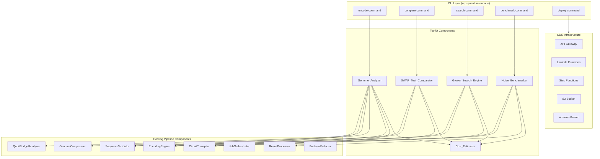
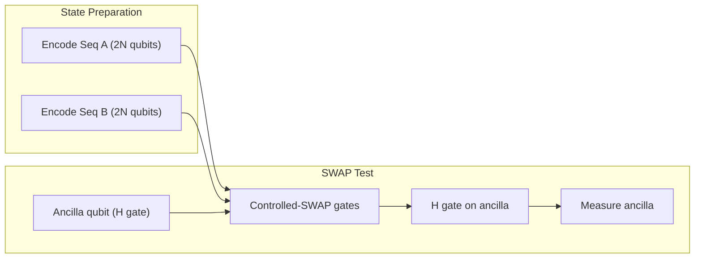
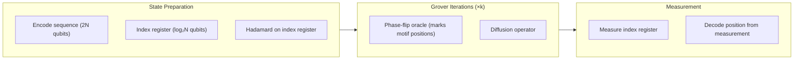

# Design Document: Quantum Genomics Toolkit

## Overview

The Quantum Genomics Toolkit extends the existing Quantum Genomics Encoding Pipeline with higher-level analysis capabilities: single genome encoding with full reporting, quantum sequence comparison (SWAP test), Grover's search for motif finding, noise benchmarking, AWS CDK deployment infrastructure, and a CLI. It builds directly on the existing `EncodingEngine`, `CircuitTranspiler`, `SequenceValidatorImpl`, `DefaultQubitBudgetAnalyzer`, `DefaultGenomeCompressor`, `ResultProcessor`, and `BackendSelector` components.

The toolkit introduces five new components and a CLI layer:

1. **Genome_Analyzer** — Orchestrates single-genome encode/decode with confidence reporting (wraps existing pipeline)
2. **SWAP_Test_Comparator** — Constructs and executes SWAP test circuits for pairwise sequence similarity
3. **Grover_Search_Engine** — Builds Grover oracle circuits to locate motifs with quadratic speedup
4. **Noise_Benchmarker** — Systematically tests encoding fidelity across configurations
5. **Cost_Estimator** — Calculates and displays cost estimates before paid backend execution
6. **CLI** — npx-executable command-line interface wrapping all toolkit operations

### Key Design Decisions

| Decision | Choice | Rationale |
|----------|--------|-----------|
| SWAP test circuit | Ancilla-based destructive SWAP test (4N+1 qubits) | Standard approach; single ancilla qubit measures overlap directly |
| Grover's oracle | Phase-flip oracle marking motif positions | Standard Grover construction; optimal iteration count π/4·√(N/M) |
| Partitioning scope | Single genome encode only | SWAP test and Grover's require full sequence coherence in one circuit |
| Cost model | Per-task + per-shot for QPU; per-minute for simulators | Matches AWS Braket pricing model directly |
| CLI framework | Commander.js via npx | Zero-install execution; well-established Node.js CLI library |
| CDK version | AWS CDK v2 | Current standard; single-package import |
| Testing | Vitest + fast-check (property-based) | Already in project devDependencies |

## Architecture



### Data Flow

1. **CLI** parses user commands and delegates to the appropriate toolkit component
2. **Cost_Estimator** intercepts paid backend requests, displays estimates, and gates on confirmation
3. **Toolkit components** compose existing pipeline components for their specific algorithms
4. **Results** flow back through the CLI for formatted output (JSON or text)

### SWAP Test Circuit Structure



The similarity score is derived from the ancilla measurement: P(|0⟩) = (1 + |⟨ψ|φ⟩|²) / 2, so similarity = 2·P(|0⟩) - 1.

### Grover's Search Circuit Structure



## Components and Interfaces

### Genome_Analyzer

```typescript
interface GenomeAnalyzerConfig {
  backend: BackendId;
  shots?: number;           // default: 1000
  scheme?: EncodingScheme;
  autoPartition?: boolean;  // default: true
}

interface GenomeAnalysisResult {
  sequence: ParsedSequence;
  encodedCircuits: EncodedCircuit[];
  transpiledCircuits: TranspiledCircuit[];
  decoded: DecodedSequence;
  report: Report;
  backend: BackendId;
  partitioned: boolean;
  segmentCount: number;
  costEstimate?: CostEstimate;
}

interface GenomeAnalyzer {
  analyze(fastaPath: string, config: GenomeAnalyzerConfig): Promise<GenomeAnalysisResult>;
}
```

### SWAP_Test_Comparator

```typescript
interface SwapTestConfig {
  backend: BackendId;
  shots?: number;  // default: 1000
}

interface SwapTestResult {
  similarityScore: number;       // 0 to 1
  ancillaMeasurements: Record<string, number>;  // '0' and '1' counts
  totalShots: number;
  sequenceA: ParsedSequence;
  sequenceB: ParsedSequence;
  circuitMetadata: {
    qubitCount: number;
    gateCount: number;
    depth: number;
  };
  costEstimate?: CostEstimate;
}

interface SwapTestComparator {
  compare(fastaPathA: string, fastaPathB: string, config: SwapTestConfig): Promise<SwapTestResult>;
  buildSwapTestCircuit(seqA: ParsedSequence, seqB: ParsedSequence, scheme: EncodingScheme): EncodedCircuit;
  calculateSimilarity(measurements: Record<string, number>, totalShots: number): number;
}
```

### Grover_Search_Engine

```typescript
interface GroverSearchConfig {
  backend: BackendId;
  shots?: number;  // default: 1000
}

interface GroverSearchResult {
  positions: number[];           // 0-indexed positions where motif found
  motif: string;
  sequenceLength: number;
  probability: number;           // measurement probability of found positions
  iterations: number;            // number of Grover iterations applied
  circuitMetadata: {
    qubitCount: number;
    gateCount: number;
    depth: number;
  };
  costEstimate?: CostEstimate;
}

interface GroverSearchEngine {
  search(fastaPath: string, motif: string, config: GroverSearchConfig): Promise<GroverSearchResult>;
  buildGroverCircuit(sequence: ParsedSequence, motif: string, scheme: EncodingScheme): EncodedCircuit;
  calculateOptimalIterations(searchSpace: number, expectedMatches: number): number;
}
```

### Noise_Benchmarker

```typescript
interface BenchmarkConfig {
  sequenceLengths: number[];     // e.g., [2, 4, 8, 12, 16]
  backends: BackendId[];
  shotCounts: number[];          // e.g., [100, 500, 1000]
}

interface BenchmarkCombinationResult {
  sequenceLength: number;
  backend: BackendId;
  shots: number;
  fidelity: number;              // fraction of correctly decoded bases
  gateCount: number;
  circuitDepth: number;
  executionTimeMs?: number;
}

interface BenchmarkReport {
  results: BenchmarkCombinationResult[];
  recommendations: Record<BackendId, number>;  // backend → max reliable sequence length
  totalCombinations: number;
  completedCombinations: number;
  totalCostEstimate?: CostEstimate;
}

interface NoiseBenchmarker {
  run(config: BenchmarkConfig, onProgress?: (progress: BenchmarkProgress) => void): Promise<BenchmarkReport>;
  validateConfig(config: BenchmarkConfig): BenchmarkConfigValidation;
}

interface BenchmarkProgress {
  currentCombination: string;    // e.g., "length=8, backend=ionq-forte, shots=1000"
  completedPercent: number;
}

interface BenchmarkConfigValidation {
  valid: boolean;
  errors: string[];
}
```

### Cost_Estimator

```typescript
interface CostEstimate {
  totalCost: number;             // in USD
  breakdown: CostBreakdown;
  backend: BackendId;
  isFree: boolean;
  estimatedExecutionTimeSeconds: number;
}

interface CostBreakdown {
  taskCost: number;              // $0.30 per task for QPU
  shotCost: number;              // $0.01 per shot for QPU
  simulatorTimeCost: number;     // $0.075/min for SV1/DM1
  totalShots: number;
  circuitCount: number;
}

interface CostEstimator {
  estimate(operation: CostableOperation): CostEstimate;
  formatEstimate(estimate: CostEstimate): string;
  isFreeBackend(backend: BackendId): boolean;
}

type CostableOperation = {
  backend: BackendId;
  shots: number;
  circuitCount: number;
  estimatedCircuitDepth: number;
};
```

### CLI Commands

```typescript
// CLI command structure (Commander.js)
// npx quantum-encode <command> [options]

interface CliOptions {
  backend?: string;       // --backend, default: 'local'
  output?: string;        // --output, write to file
  format?: 'json' | 'text';  // --format, default: 'text'
  yes?: boolean;          // --yes, skip cost confirmation
}

// Commands:
// encode <fasta-file> [--backend] [--output] [--format]
// compare <fasta-a> <fasta-b> [--backend] [--output] [--format]
// search <fasta-file> --motif <pattern> [--backend] [--output] [--format]
// benchmark [--config <file>] [--lengths] [--backends] [--shots] [--output] [--format]
// deploy [--region] [--stack-name] [--backends]
```

## Data Models

### Extended Backend Configuration

The toolkit extends the existing `BackendId` type to include SV1 and DM1:

```typescript
type ExtendedBackendId = BackendId | 'braket-sv1' | 'braket-dm1';

interface ExtendedBackendConfig extends BackendConfig {
  costModel: 'free' | 'per-minute' | 'per-task-and-shot';
  costPerMinute?: number;        // for SV1, DM1
  costPerTask?: number;          // for QPU backends
  costPerShot?: number;          // for QPU backends
  isNoisy: boolean;
  region: string;
}

const EXTENDED_BACKENDS: Record<ExtendedBackendId, ExtendedBackendConfig> = {
  'braket-local-simulator': {
    ...BRAKET_LOCAL_SIMULATOR,
    costModel: 'free',
    isNoisy: false,
    region: 'local',
  },
  'braket-sv1': {
    id: 'braket-sv1' as BackendId,
    name: 'Amazon Braket SV1',
    provider: 'AWS',
    qubitCount: Infinity,  // unlimited
    nativeGates: ['*'],
    connectivity: { type: 'all-to-all' },
    costModel: 'per-minute',
    costPerMinute: 0.075,
    isNoisy: false,
    region: 'us-east-1',
  },
  'braket-dm1': {
    id: 'braket-dm1' as BackendId,
    name: 'Amazon Braket DM1',
    provider: 'AWS',
    qubitCount: 17,
    nativeGates: ['*'],
    connectivity: { type: 'all-to-all' },
    costModel: 'per-minute',
    costPerMinute: 0.075,
    isNoisy: true,
    region: 'us-east-1',
  },
  'ionq-forte-enterprise': {
    ...IONQ_FORTE_ENTERPRISE,
    costModel: 'per-task-and-shot',
    costPerTask: 0.30,
    costPerShot: 0.01,
    isNoisy: true,
    region: 'us-east-1',
  },
  'rigetti-cepheus-1': {
    ...RIGETTI_CEPHEUS_1,
    costModel: 'per-task-and-shot',
    costPerTask: 0.30,
    costPerShot: 0.01,
    isNoisy: true,
    region: 'us-west-1',
  },
};
```

### Per-Operation Qubit Formulas

```typescript
interface QubitRequirement {
  operation: 'encode' | 'swap-test' | 'grover-search';
  formula: (sequenceLength: number) => number;
  supportsPartitioning: boolean;
}

const QUBIT_REQUIREMENTS: Record<string, QubitRequirement> = {
  encode: {
    operation: 'encode',
    formula: (N) => 2 * N,
    supportsPartitioning: true,
  },
  'swap-test': {
    operation: 'swap-test',
    formula: (N) => 4 * N + 1,  // 2N per sequence + 1 ancilla
    supportsPartitioning: false,
  },
  'grover-search': {
    operation: 'grover-search',
    formula: (N) => 2 * N + Math.ceil(Math.log2(N)),  // sequence + index register
    supportsPartitioning: false,
  },
};
```

### FASTA Validation Model (Toolkit-Specific)

```typescript
interface FastaValidationResult {
  valid: boolean;
  errors: FastaValidationError[];
  sequence?: ParsedSequence;
}

interface FastaValidationError {
  type: 'wrong-extension' | 'invalid-format' | 'ambiguous-codes' | 'exceeds-backend-limit';
  message: string;
  details?: {
    invalidCharacters?: { char: string; position: number }[];
    maxAllowed?: number;
    actualLength?: number;
    backend?: ExtendedBackendId;
    operation?: string;
  };
}
```

### CDK Stack Configuration

```typescript
interface CdkStackConfig {
  region: string;
  stackName: string;
  allowedBackends: ExtendedBackendId[];
  tags?: Record<string, string>;
}

interface CdkStackOutputs {
  apiEndpoint: string;
  s3BucketName: string;
  stateMachineArn: string;
}
```


## Correctness Properties

*A property is a characteristic or behavior that should hold true across all valid executions of a system — essentially, a formal statement about what the system should do. Properties serve as the bridge between human-readable specifications and machine-verifiable correctness guarantees.*

### Property 1: Encode/Decode Round-Trip on Noiseless Simulator

*For any* valid nucleotide sequence (containing only A, C, G, T for DNA or A, C, G, U for RNA), encoding the sequence into a quantum circuit and decoding the measurement results from a noiseless simulator (where all shots return the correct bitstring) SHALL produce the original sequence with 100% fidelity.

**Validates: Requirements 1.7, 4.9**

### Property 2: Per-Operation Qubit Limit Enforcement

*For any* combination of operation type (encode, swap-test, grover-search), sequence length, and backend, the system SHALL reject the operation if the qubit requirement (encode: 2N, swap-test: 4N+1, grover: 2N+⌈log₂N⌉) exceeds the backend's qubit capacity, and SHALL accept it otherwise.

**Validates: Requirements 1.2, 2.6, 2.7, 3.6, 7.5**

### Property 3: Partitioning Produces Valid Segments

*For any* sequence exceeding a backend's maximum for single genome encoding, partitioning SHALL produce segments where each segment's qubit requirement (2 × segment_length) does not exceed the backend's qubit capacity, and all segments have the specified overlap (10 nucleotides) with adjacent segments.

**Validates: Requirements 1.3**

### Property 4: SWAP Test Circuit Qubit Count

*For any* two equal-length sequences of length N, the constructed SWAP test circuit SHALL have exactly 4N + 1 qubits (2N for each encoded sequence plus 1 ancilla qubit).

**Validates: Requirements 2.2**

### Property 5: Similarity Score Range Invariant

*For any* ancilla measurement distribution (counts of |0⟩ and |1⟩ outcomes), the calculated similarity score SHALL be between 0 and 1 inclusive.

**Validates: Requirements 2.3**

### Property 6: SWAP Test Equal-Length Enforcement

*For any* two sequences of unequal length, the SWAP test comparator SHALL reject the comparison with an error that contains both sequence lengths.

**Validates: Requirements 2.4, 2.5**

### Property 7: Identical Sequences Produce High Similarity

*For any* valid nucleotide sequence compared with itself using a noiseless simulator with at least 1000 shots, the SWAP test SHALL produce a similarity score greater than 0.9.

**Validates: Requirements 2.8**

### Property 8: Maximally Different Sequences Produce Low Similarity

*For any* pair of equal-length sequences where no bases match (e.g., complement mapping A↔T, C↔G), the SWAP test on a noiseless simulator with at least 1000 shots SHALL produce a similarity score less than 0.5.

**Validates: Requirements 2.9**

### Property 9: Motif Character Validation

*For any* motif string, the Grover search engine SHALL accept it if and only if it contains exclusively valid nucleotide characters (A, C, G, T for DNA; A, C, G, U for RNA), and SHALL reject invalid motifs with an error listing each invalid character and its position.

**Validates: Requirements 3.1, 3.2**

### Property 10: Optimal Grover Iteration Count

*For any* search space size N > 0 and expected match count M where 0 < M ≤ N, the calculated optimal iteration count SHALL equal round(π/4 × √(N/M)).

**Validates: Requirements 3.4**

### Property 11: Motif Length Must Be Shorter Than Sequence

*For any* motif whose length is greater than or equal to the input sequence length, the Grover search engine SHALL reject the operation with an appropriate error.

**Validates: Requirements 3.7**

### Property 12: Benchmark Configuration Validation

*For any* benchmark configuration, the validator SHALL reject configs where any sequence length exceeds the corresponding backend's capacity, any shot count is outside [100, 10000], or any backend identifier is unknown, and SHALL identify each invalid parameter in the error.

**Validates: Requirements 4.2, 4.3**

### Property 13: Fidelity Calculation Correctness

*For any* original nucleotide sequence and decoded nucleotide sequence of equal length, the calculated fidelity SHALL equal the number of positions where the characters match divided by the total sequence length.

**Validates: Requirements 4.4**

### Property 14: Random Sequence Generation Validity

*For any* requested sequence length between 2 and 1000, the generated random nucleotide sequence SHALL have exactly the requested length and contain only valid nucleotide characters (A, C, G, T).

**Validates: Requirements 4.6**

### Property 15: Cost Estimation Matches Pricing Model

*For any* operation targeting a paid backend with a given shot count and circuit count, the estimated cost SHALL equal: (costPerTask × circuitCount) + (costPerShot × shots × circuitCount) for QPU backends, or (costPerMinute × estimatedMinutes) for simulator backends.

**Validates: Requirements 8.1, 1.6, 2.10, 3.10**

### Property 16: Free Backend Always Reports Zero Cost

*For any* operation targeting the local simulator backend, the cost estimate SHALL report totalCost of 0 and isFree of true, regardless of shots or circuit count.

**Validates: Requirements 8.3**

### Property 17: Cost Display Contains Required Fields

*For any* cost estimate, the formatted display string SHALL contain the number of shots, the backend name, and the estimated execution time.

**Validates: Requirements 8.4**

### Property 18: FASTA Validation Rejects Invalid Input

*For any* file that either (a) has an extension other than .fa or .fasta, (b) lacks a header line starting with ">", (c) contains non-nucleotide characters in sequence lines, or (d) contains ambiguous codes (N, R, Y, etc.), the toolkit SHALL reject it with an error describing the specific violation.

**Validates: Requirements 7.1, 7.2, 7.3, 7.4**

### Property 19: CLI Default Backend Selection

*For any* CLI command invoked without the --backend option, the system SHALL use the local simulator as the execution backend.

**Validates: Requirements 6.7**

### Property 20: CLI JSON Output Validity

*For any* toolkit operation result formatted with --format json, the output SHALL be valid JSON that can be parsed without error.

**Validates: Requirements 6.12**

## Error Handling

### Error Categories and Responses

| Category | Trigger | Response | Exit Code (CLI) |
|----------|---------|----------|-----------------|
| File Not Found | FASTA path doesn't exist | Error with file path and "not found" message | 1 |
| Invalid Format | Non-FASTA extension or malformed content | Error describing format violation | 1 |
| Ambiguous Codes | N, R, Y, etc. in sequence | Error listing each invalid char and position | 1 |
| Sequence Too Long | Exceeds backend limit for operation | Error stating max allowed length and backend | 1 |
| Unequal Lengths | SWAP test with different-length sequences | Error with both lengths | 1 |
| Invalid Motif | Non-nucleotide characters in motif | Error listing invalid chars and positions | 1 |
| Motif Too Long | Motif ≥ sequence length | Error stating motif must be shorter | 1 |
| Invalid Benchmark Config | Out-of-range parameters | Error identifying each invalid parameter | 1 |
| Cost Declined | User declines cost confirmation | Cancellation message, no job submitted | 0 |
| Backend Unavailable | QPU offline or unreachable | Error with backend status and suggestion | 1 |
| CDK Deployment Failure | CloudFormation error | Error with failure reason and affected resource | 1 |
| Execution Timeout | Quantum job exceeds timeout | Error with job ID and timeout duration | 1 |

### Error Propagation Strategy

1. **Validation errors** are caught at the component boundary and returned as structured error objects (not thrown exceptions) to allow the CLI to format them appropriately.
2. **Execution errors** (backend failures, timeouts) are caught by the orchestrator and wrapped with context (job ID, backend, operation type).
3. **CDK errors** are caught from CloudFormation events and enriched with the specific resource and failure reason.
4. All errors include a `code` field for programmatic handling and a `message` field for human display.

```typescript
interface ToolkitError {
  code: string;           // e.g., 'SEQUENCE_TOO_LONG', 'INVALID_MOTIF'
  message: string;        // human-readable description
  details?: Record<string, unknown>;  // structured context
}
```

## Testing Strategy

### Property-Based Testing (fast-check)

The project already uses `fast-check` (v3.23.0) and `vitest` (v2.1.0). Property-based tests will be implemented for all 20 correctness properties defined above.

**Configuration:**
- Minimum 100 iterations per property test
- Each test tagged with: `Feature: quantum-genomics-toolkit, Property {N}: {title}`
- Tests located in `tests/toolkit/` directory structure

**Property test targets:**
- `CostEstimator.estimate()` — Properties 15, 16, 17
- `SwapTestComparator.calculateSimilarity()` — Property 5
- `SwapTestComparator.buildSwapTestCircuit()` — Properties 4, 6
- `GroverSearchEngine.calculateOptimalIterations()` — Property 10
- `GroverSearchEngine.validateMotif()` — Properties 9, 11
- `NoiseBenchmarker.calculateFidelity()` — Property 13
- `NoiseBenchmarker.generateRandomSequence()` — Property 14
- `NoiseBenchmarker.validateConfig()` — Property 12
- `QubitLimitEnforcer.enforce()` — Property 2
- `GenomeCompressor.partition()` — Property 3
- `EncodingEngine.encode() + decode()` — Property 1
- `FastaValidator.validate()` — Property 18
- `SwapTestComparator` (with noiseless mock) — Properties 7, 8
- CLI argument parsing — Properties 19, 20

### Unit Tests (example-based)

- CLI command parsing (encode, compare, search, benchmark, deploy)
- Cost confirmation flow (accept/decline)
- Progress reporting callbacks
- Output formatting (JSON vs text)
- Help and version display
- File output (--output option)

### Integration Tests

- Full pipeline flow: FASTA → encode → execute → decode → report
- SWAP test end-to-end with local simulator
- Grover's search end-to-end with local simulator
- Benchmark suite with local simulator
- CDK stack synthesis and assertion tests

### CDK Tests (snapshot/assertion)

- Stack synthesizes without errors
- API Gateway has correct endpoints
- Lambda functions have correct memory/timeout
- S3 bucket has encryption enabled
- IAM roles follow least-privilege
- All resources are tagged
- Stack outputs are defined

### Test Organization

```
tests/
├── toolkit/
│   ├── genome-analyzer.test.ts
│   ├── swap-test-comparator.test.ts
│   ├── grover-search-engine.test.ts
│   ├── noise-benchmarker.test.ts
│   ├── cost-estimator.test.ts
│   ├── fasta-validator.test.ts
│   ├── qubit-limits.test.ts
│   └── cli.test.ts
├── toolkit-properties/
│   ├── round-trip.property.test.ts
│   ├── qubit-limits.property.test.ts
│   ├── swap-test.property.test.ts
│   ├── grover.property.test.ts
│   ├── benchmarker.property.test.ts
│   ├── cost-estimator.property.test.ts
│   ├── fasta-validation.property.test.ts
│   └── cli.property.test.ts
├── cdk/
│   └── stack.test.ts
└── integration/
    ├── encode-flow.test.ts
    ├── compare-flow.test.ts
    ├── search-flow.test.ts
    └── benchmark-flow.test.ts
```
